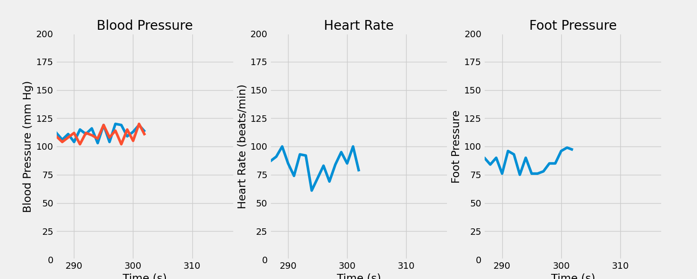
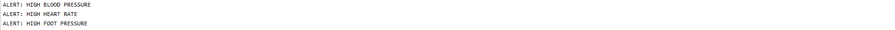

This is repository to hold the Health Monitoring Unity Project

The repository contains multiple modules developed independently. 

## Sensors:
Author: Brian

Description: 

-- Input: None

-- Output: Dictionary containing three randomly generated numbers which represent output of three sensors feeding into our Vitals Check.

## Display:

Author: Ed

Description: 

-- Input: setting, data inputs (updated sec by sec)

-- Outpu: graphs + numbers for blood pressure, heart rate, oxygen concentration in pyqt gUI

## Storage:

Author: JP

Description: 

-- Input

-- Output

## Vitals:

Author: Danny

Description: The vitals module takes in data from the sensor modules in a dictionary format. It has functions that allow the user to 
set uppper and lower thresholds for blood pressure, heart rate, and foot pressure. If any of these values exceed the threshold,
a callback to the processor thread occurs.

-- Input dict  
         dict['heartRate'] = heartRate [int]  
         dict['footPressure'] = footPressure [int]   
         dict['bloodPressure'] = bloodPressure [int, int]

-- Output alerts = [['n', 0], ['n', 0], ['n', [0, 0]]]  
                'n' = normal   
                'h' = high   
                'l' = low

## Processor:

Author: Steven

Description: Takes in the data from the previous modules and processes it for displaying and keeping track of alerts.

-- Input: Vital data, current alerts, and the time settings from the settings module.

-- Output: Dictionary with the time setting and alert code created from the vital data. The alert code is a string of 3 numbers that represent each of the three vitals with values of 0,1, and 2 corresponding to high, low, or normal  readings. 

## Settings:

Author: Jenny

Description: Every 15 seconds, a random time setting is designated and sent to the processor for display.

-- Input: None (runs independently)

-- Output: Integer representing time display interval (in minutes, but changes every 15 seconds)

## AI:

Author: Jenny

Description: Reads out a file, then makes a pseudo-prediction of changes to pulse, blood pressure, and oxygen levels.

-- Input: File (.txt, .csv, etc.)

-- Output: List of integers (heart rate, blood pressure, and oxygen level predictions)

## Overall Architecture

For Process-Thread decisions, we decided to go with two processes. One of the processes handles the alerts,
generation of data, writing to a csv and etc. The other process is solely producing the graphs for visual
display. This decision was made because generally any visual component will always have more overhead than
calculations.

## Inteface

## How to Run

To run the health-monitor, the user navigates to the icu_main folder and and runs python main_run_script.py.
All data is logged into data.csv. Alerts for high blood pressure, heart rate, and foot pressure are printed in the
command line.