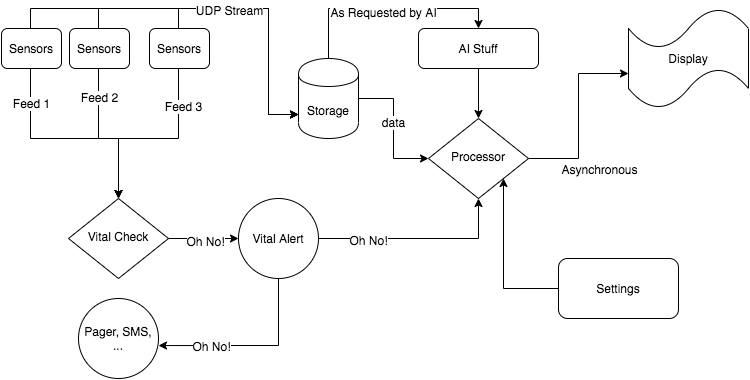

This is repository to hold the Health Monitoring Unity Project

The repository contains multiple modules developed independently. 

## Sensors:
Author: Brian

Description: 

-- Input

-- Output

## Display:

Author: Ed

Description: 

-- Input: setting, data inputs (updated sec by sec)

-- Outpu: graphs + numbers for blood pressure, heart rate, oxygen concentration in pyqt gUI

## Storage:

Author: JP

Description: 

-- Input

-- Output

## Vitals:

Author: Danny

Description: 

-- Input

-- Output

## Processor:

Author: Steven

Description: 

-- Input

-- Output

## Settings:

Author: Jenny

Description: 

-- Input

-- Output

## Processor:

Author: Steven

Description: 

-- Input

-- Output

## Overall Architecture

