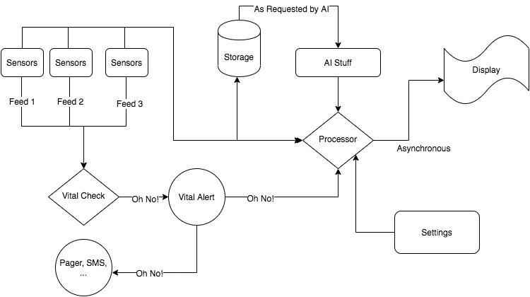

This is repository to hold the Health Monitoring Unity Project

The repository contains multiple modules developed independently. 

## Sensors:
Author: Brian

Description: 

-- Input

-- Output

## Display:

Author: Ed

Description: 

-- Input: setting, data inputs (updated sec by sec)

-- Outpu: graphs + numbers for blood pressure, heart rate, oxygen concentration in pyqt gUI

## Storage:

Author: JP

Description: 

-- Input

-- Output

## Vitals:

Author: Danny

Description: The vitals module takes in data from the sensor modules in a dictionary format. It has functions that allow the user to 
set uppper and lower thresholds for blood pressure, heart rate, and foot pressure. If any of these values exceed the threshold,
a callback to the processor thread occurs.

-- Input dict['heartRate'] = heartRate
         dict['footPressure'] = footPressure
         dict['bloodPressure'] = bloodPressure

-- Output alerts = [['n', 0], ['n', 0], ['n', [0, 0]]]
                'n' = normal
                'h' = high
                'l' = low

## Processor:

Author: Steven

Description: 

-- Input

-- Output

## Settings:

Author: Jenny

Description: Every 15 seconds, a random time setting is designated and sent to the processor for display.

-- Input: None (runs independently)

-- Output: Integer representing time display interval (in minutes, but changes every 15 seconds)

## AI:

Author: Jenny

Description: Reads out a file, then makes a pseudo-prediction of changes to pulse, blood pressure, and oxygen levels.

-- Input: File (.txt, .csv, etc.)

-- Output: List of integers (heart rate, blood pressure, and oxygen level predictions)

## Overall Architecture

